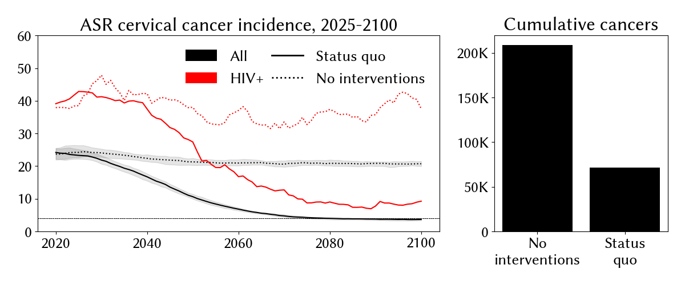
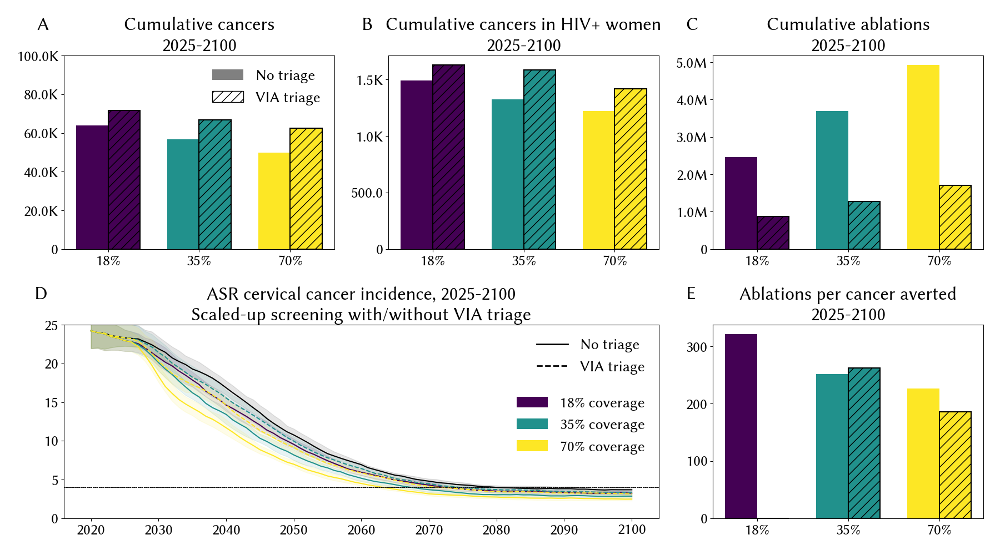
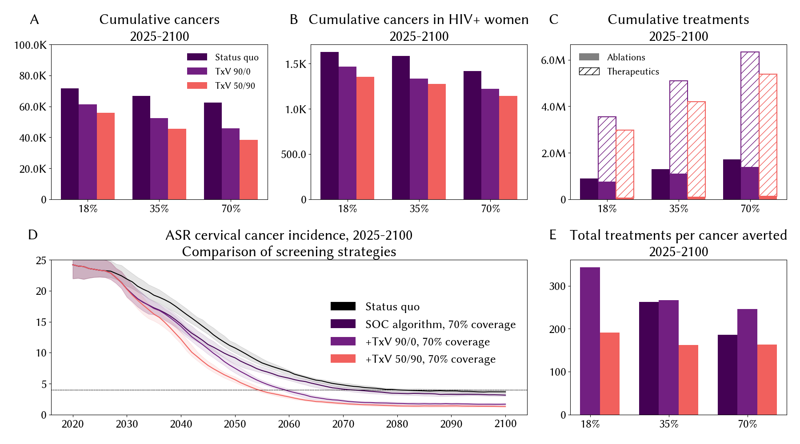
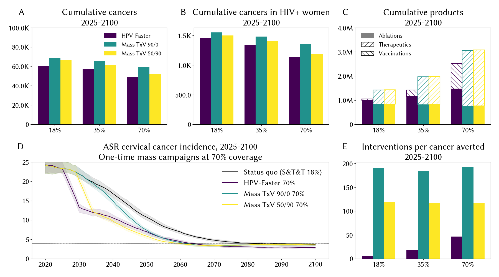
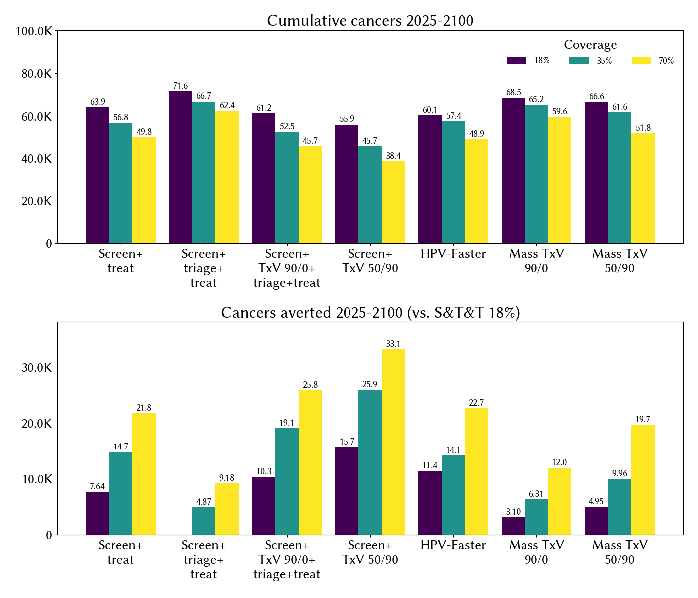

# Strategies to accelerate cervical cancer elimination: a modeling study in Rwanda

1,2Jean Claude Dusingize, 2Gad Murenzi, 3Gary Clifford, 1Marcel Yotebieng, 1Kathryn Anastos,

4\* Robyn M. Stuart

1 Department of Medicine, Albert Einstein College of Medicine, Bronx, New York, USA.

2 Einstein-Rwanda Research and Capacity Building Program, Research for Development (RD

Rwanda), Kigali, Rwanda.

3 International Agency for Research on Cancer (IARC/WHO), Early Detection Prevention and Infections Branch, Lyon, France.

4 Gates Foundation, Seattle, Washington, United States of America.

\* Corresponding author: robyna.s@gmail.com

## Abstract

**Background**: Despite Rwanda's successful HPV vaccination program achieving 80-90% coverage since 2011, screening coverage remains low at 18%, leaving a substantial residual burden of cervical cancer. This study evaluates seven strategies to reduce this burden and accelerate elimination.

**Methods**: We used HPVsim, an agent-based microsimulation model, to project cervical cancer incidence in Rwanda from 2030-2100 under continuation of status quo programs vs under seven different elimination strategies: (1-2) strengthening screening and treatment programs with/without triage; (3-4) therapeutic vaccines integrated into intensified screening programs; (5) one-time mass screening and vaccination campaign for women aged 20-50; (6-7) mass therapeutic vaccination programs using hypothetical virus-clearing or lesion-regressing vaccines. We modeled two therapeutic vaccine profiles: a virus-clearing vaccine with 90% efficacy against HPV 16/18 infections and low-grade lesions, and a lesion-regressing vaccine with 50% efficacy against infections/low-grade lesions and 90% efficacy against high-grade lesions.

**Results**: Under current programs, Rwanda is projected to experience 101,000 (83,000-149,000) cervical cancer cases over 2030-2100, with cervical cancer incidence declining but not reaching elimination (ASR <4 per 100,000) by 2100. Current programs prevent an estimated 203,000 cases compared to no interventions. Four strategies at 70% coverage each averted 37,000-40,000 additional cases and accelerated elimination to 2061-2065: mass delivery of a lesion-regressing therapeutic vaccine (40,000 averted), a one-time mass screen-and-vaccinate campaign for women 20-50 (39,000), scaled-up screen-and-treat (HPV DNA plus same-visit ablation, without VIA triage) (37,000), and screening with a lesion-regressing therapeutic vaccine (37,000). Adding a virus-clearing therapeutic to screening, or delivering it as a mass campaign, averted 25,000-31,000 cases; strengthening the current screen-triage-treat program averted 16,000 cases.

**Conclusions**: While Rwanda's prophylactic vaccination program will prevent the majority of future cervical cancers, substantial residual burden remains. Multiple achievable strategies could each further reduce this burden by roughly 40% and bring cervical cancer elimination forward by at least two decades. These findings support continued investment in improved screening and treatment strategies to complement existing prevention efforts and achieve cervical cancer elimination decades sooner, and in the continued development of HPV therapeutic vaccines as a complementary future option.

## Introduction

Cervical cancer elimination, defined as reaching and maintaining an incidence rate of below 4 per 100,000 women, has the potential to avert more than 300,000 deaths per year globally (1). The World Health Organization created the “90-70-90” strategy for achieving cervical cancer elimination, corresponding to a set of programmatic targets that make use of the highly effective suite of available interventions against cervical cancer (2). The strategy sets global targets of 90% coverage of prophylactic vaccination against human papillomavirus (HPV) for adolescent girls, 70% coverage of cervical screening for women aged 30-50, and 90% uptake of treatment for those with cervical disease (2). In countries with high rates of both vaccination and screening, cervical cancer elimination is estimated to be a probable reality within 10-20 years (3,4). Mathematical modeling studies have made the case that high rates of vaccination and screening would correspond to global elimination within 100 years (5,6).

Despite evidence demonstrating that the 90-70-90 targets would lead to cervical cancer elimination, over the decades prior to elimination there would still be a significant burden of cervical cancer in the population. In particular, the full impact of HPV vaccination on cervical cancer rates will take decades to materialize. Consequently, there has been some interest in ways to speed up the time to elimination, and reduce the number of cancers anticipated over the next 100 years. Catch-up vaccination campaigns for multi-age cohorts (MACs) of older girls have been estimated to be highly effective (7–9) and have already been endorsed and rolled out in numerous countries. To bolster screening programs and provide protection against cervical disease progression for women already infected with HPV, studies are underway to investigate more sensitive tests, point-of-care tests, and self-tests (10,11). On the treatment front, novel HPV therapeutic vaccines targeting high-grade lesions and/or HPV infection, although still in early stages of development, have nonetheless progressed far enough through clinical trials to prompt investigations into their cost-effectiveness and health impact (12–15).

In Rwanda, there are an estimated 1,200 cases of cervical cancer annually, with an estimated age-standardized rate (ASR) of cervical cancer incidence of 28 per 100,000 women (16). Prophylactic vaccination programs are well-established, having begun in 2011 and attained coverage levels of 80-90% over 2020-2024 (17).  Screening and treatment programs, however, have not achieved comparable coverage, with only 18% of women screened during their lifetime (18). Without improved programs to protect unvaccinated women against cervical disease, Rwandan women will continue to experience thousands of cases of cervical cancer over the coming decades.

The goal of this study is to calculate the residual burden of cervical cancer in Rwanda over the next 75 years, and then assess seven possible approaches for reducing this burden.  Firstly, we consider two scenarios in which existing screening and treatment programs are scaled up to reach WHO targets of 70% lifetime screening coverage, either with/without the current protocol of VIA triage prior to treatment. The third and fourth strategies that we consider involve further strengthening screening and treatment algorithms with the addition of a hypothetical HPV therapeutic vaccine with varying characteristics as a treatment option either instead of or in addition to thermal ablation. Fifth, we consider an “HPV-Faster” strategy, which consists of recruiting women aged 20-50 to a one-time mass screening and vaccination campaign in which all women are offered HPV vaccination as well as screening with a sensitive point-of-care HPV DNA test, and women who test positive to HPV are offered immediate treatment (in line with WHO recommendations).  Finally, we consider two strategies where a therapeutic vaccine is delivered through a mass vaccination program. We use a microsimulation model of HPV and HIV infection to estimate the number of cervical cancer cases and cases averted under each scenario.

To date, there has been one published study (19) that uses dynamic modeling to evaluate the potential impact of an HPV therapeutic vaccine. This study aims to situate the HPV therapeutic vaccine alongside several other strategies for meeting the needs of women who have been missed by prophylactic vaccination, and to investigate the differential impact that might be expected from an HPV therapeutic vaccine with action on either virus and high-grade pre-cancer. Its intended audience is country planners weighing options against the residual burden of cervical cancer in high-vaccination settings, and research funders and product developers considering investment in therapeutic HPV vaccine development.

## Methods

### Model description

We use HPVsim (20,21), an agent-based microsimulator built on the Starsim disease modeling architecture (22), to create a model of HPV infection and cervical disease progression for Rwanda. We begin by initializing a set of 10,000 agents with the same age/sex composition as Rwanda in 1960. We update the population demographics over time, accounting for births, deaths, and migration using UN data (23). HPV is transmitted between sexually active agents over HPVsim’s sexual network, which accounts for differential levels of sexual activity over time as women reach sexual debut and engage in both casual and longer-term stable partnerships (e.g. marriage). More details on HPVsim’s sexual network are contained in Stuart et al (20), and details on how the sexual network is customized for different countries (including Rwanda) can be found in related publications (24). HPV progression to cervical cancer follows the natural history model described in these publications, whereby HPV infection can either clear naturally (with/without low-grade lesions) or progress to high-grade lesions, from which  either clearance or invasion to cervical cancer are possible, depending on the duration of cervical disease. In these analyses, we consider four groupings of HPV genotypes: type 16, type 18, a pooled group of high-risk types 31, 33, 45, 52, and 58 (“Hi5”), and a pooled collection of types 35, 39, 51, 56, and 59 (“OHR”). Because WLHIV are at increased risk of cervical cancer (25), we also include HPVsim’s HIV module, which uses estimates of HIV incidence and antiretroviral therapy (ART) obtained from UNAIDS.

To represent current and historical programs in Rwanda, we include HPV vaccination for 12-year-old girls, modeled as a two-dose regimen commencing in 2011. We also represent Rwanda’s screening and treatment algorithm, reproduced in Figure S1. We set the lifetime coverage of screening among women aged 30-50 to 18% (18). Women who test positive to HPV are triaged with visual inspection with acetic acid (VIA) and either treated with thermal ablation or excision (if visible lesions), or requested to return within 1 year (if no visible lesions).

Localizing the model to Rwanda involves tuning some of the parameters so that the model is representative of the epidemiology of HPV and cervical cancer in Rwanda. We use an automated Bayesian optimization algorithm for parameter tuning, described elsewhere and integrated into HPVsim (20,26). To fit the model, we use data on cervical cancer cases by age, cervical cancer incidence by age and by HIV status, the distribution of HPV types found within women with normal cervical cytology, the distribution of HPV types found in women with invasive cervical cancer. All data were taken from Globocan 2020 estimates and HPV Information Centre compiled meta-analyses. We ran 10,000 trials, with each trial representing a model run from 1960-2025 with a single set of parameters, searching for the parameters that minimise the sum of the normalised absolute differences between the model estimates and these data. From this, we select the best-fitting 50 parameter sets. The 17 calibrated parameters, together with their prior ranges, prior sources, and posterior summaries across the 50 best-fitting sets, are given in Table S1.

### Estimating the residual burden and time to cervical cancer elimination

We use our 50 best-fitting parameter sets to project forward from 2030 until 2100. We estimate the number of cancer cases and the ASR of cancer incidence over time and report the median and 10-90% intervals on the assumption that coverage of vaccination and screening programs continue at their baseline levels (i.e. 90% coverage of prophylactic vaccination and 18% coverage of screening). We then project forward over the same timeframe assuming cessation of existing programs, so that we can demonstrate the impact of continued current programs.

### Evaluating strategies to reduce residual burden and time to cervical cancer elimination

Cervical screening and treatment are core pillars of the WHO strategy for achieving cervical cancer elimination, so we first consider scenarios in which these programs are strengthened. We model three screening coverage variations: maintaining historical screening coverage levels (18%), a doubling of historical screening coverage (35%), and reaching WHO screening targets (70%). For all scenarios, we assume that screening is conducted using HPV DNA testing with assumed sensitivity of 99% for detecting HPV. We then model two alternative algorithms: a continuation of the ‘screen-triage-treat’ protocol in which women with positive HPV DNA tests are triaged on the same visit with visual inspection using acetic acid (VIA) and then treatment is performed on the same day for those determined to require it, and a ‘screen-treat’ option in which VIA triage is not performed; direct visualisation of the cervix is still required to perform the ablation itself, but treatment is offered to all women testing positive to HPV DNA rather than being filtered by a positive VIA result. For the screen-triage-treat scenario, we assume that VIA has sensitivity/specificity of 60/70% for detecting high-grade lesions. In both scenarios, women are asked to wait after their HPV DNA test until their results are ready; in line with prior studies (27), we assume that 90% of women will wait while the remainder will be lost to follow up. Previous studies also reported that 75% of women who were VIA-positive received ablative treatment (27), and that a key factor contributing to the 25% who did not receive treatment was a low availability of trained providers. We therefore assume that in both the screen-triage-treat scenario and the screen-treat scenario, 25% of women eligible for treatment will not receive it.

For the strategies involving delivery of an HPV therapeutic vaccine, we make assumptions about the product's characteristics and mechanism of action, since no such product is currently licensed. WHO has articulated preferred product characteristics (PPCs) for therapeutic HPV vaccines that distinguish two product archetypes: vaccines that primarily clear oncogenic HPV infection, and vaccines that primarily induce regression of high-grade cervical precancers (28,29). Both are expected to act by inducing a CD8+ T-cell response directed against the early viral proteins E6 and E7 (15,28). We model each of the two delivery strategies under two sets of product assumptions corresponding to these archetypes. For the "virus-clearing" therapeutic, we assume the vaccine clears 90% of HPV 16/18 productive infections and low-grade lesions that would not clear spontaneously, with no efficacy against high-grade lesions. The 90% value is consistent with the WHO PPC statement that, for a vaccine clearing only HPV 16 and 18, "high efficacy will likely be needed (e.g. 70-90%)" (28), with the 90% target efficacy used in trial-design power calculations (15), and with prior modelling of this product archetype (12,30,31,32); restricting the effect to infections that would not clear spontaneously reflects the approximately 90% background clearance of incident HPV infection within two years (15). For the "lesion-regressing" therapeutic, we assume the vaccine clears 50% of HPV 16/18 productive infections and low-grade lesions and induces regression of 90% of high-grade lesions, mirroring the "0-90" and "50-50" product profiles explored in prior modelling (30,31); partial activity against productive infection is retained on the basis that an E6/E7-directed cellular response would be expected to act on productive infection as well as on established lesions. We note that 90% efficacy against high-grade lesions exceeds efficacy observed in phase II/III trials to date, which has been modest (14); as with the PPCs themselves, these values should be interpreted as target-product-profile assumptions rather than empirically established efficacy estimates (32).

In both cases we assume no cross-protection against other high-risk HPV types, consistent with the WHO PPC minimum indication of HPV 16/18 (28) and the base-case assumptions of previous models (12,30,32). We assume the vaccine acts with a 3-month delay between administration and infection clearance or lesion regression; this is a deliberately conservative simplification representing the time required for the vaccine-induced cellular response to develop and act, rather than a value observed directly, since trial endpoints are assessed at fixed later timepoints (36 weeks for lesion regression, at least 24 months for virologic clearance) that incorporate confirmatory testing rather than measuring time to effect (15). We further assume that therapeutic-induced clearance or regression confers the same level of immunity against future infection as natural clearance or spontaneous regression, following Spencer et al. (12). Although current candidates are expected to be delivered over two visits, the PPCs state that a single-dose primary immunization would be ideal while a two-dose primary schedule would be considered acceptable (28); for simplicity we assume single-visit delivery. Product availability is assumed from 2030, the introduction year used in prior TxV modelling studies (30,31,32), with the sensitivity of our results to this assumption explored in Figure S4.

For the scenarios in which the therapeutic vaccine is delivered within a screening program, we assume that it would be offered to all women with a positive HPV DNA test on the same visit, with 90% acceptance (in keeping with the 10% loss to follow up rate assumed in the previous screening scenarios, and representing the proportion of women who do not wait for their results). In the case of the lesion-regressing therapeutic, we assume the therapeutic would be given without further triage and would function as a replacement for thermal ablative treatment. In the case of the virus-clearing therapeutic, we assume that in addition to receiving the therapeutic vaccine, women would also be triaged with VIA to determine eligibility for ablative treatment, as per the current protocol, with 25% of women lost to follow up between VIA and ablation.

The four strategies described so far all rely on strengthening existing screening infrastructure. By contrast, our final three scenarios represent one-time campaigns. For the “HPV-Faster” scenario, we consider a one-time mass campaign in 2028 to screen and vaccinate women aged 20-50. HPV prophylactic vaccination would be given to all women in addition to a HPV DNA test with 99% sensitivity. All women testing positive would be offered immediate ablation without triage. As in the screen-treat scenarios, we assume 10% of women are lost to follow up between HPV DNA testing and same-visit treatment. Similarly, for the final two scenarios involving mass delivery of a therapeutic vaccine (either virus-clearing or lesion-regressing), we assume this would be delivered as a one-time campaign targeted at women aged 20-50.

An overview of the seven scenarios that we consider is presented in Table 1. For each scenario we consider 3 possible coverage levels, making 21 scenarios in total in addition to the 2 scenarios outlined in the previous section (continuation of status quo and no interventions). The coverage levels we consider correspond to a continuation of historical screening coverage levels (18%), a doubling of historical screening coverage (35%), and reaching WHO screening targets (70%). For each scenario, we calculate cervical cancers and the ASR of cervical cancer incidence both overall and within HIV+ women over time, and report the median and 10-90% intervals across the 50 best-fitting parameter sets for each one. Cumulative intervention counts per scenario are reported in Table S2.

| **#** | **Strategy** | **Year(s)** | **Coverage** | **Description** |
|---|---|---|---|---|
| 1 | Screen-triage-treat: strengthen screening & treatment algorithm | 2028- | 18, 35, 70% of women screened per lifetime | Screen women 30-50 using HPV-DNA test. 90% of women testing positive on HPV-DNA test receive their results and go onto VIA triage; 75% uptake of ablative treatment among women identified through VIA as needing treatment |
| 2 | Screen-treat: strengthen and streamline screening & treatment algorithm | 2028- | 18, 35, 70% of women screened per lifetime | Screen women 30-50, using HPV-DNA test. 90% of women testing positive on HPV-DNA test receive their results and go onto ablative treatment if indicated. |
| 3 | Screen-therapeutic-triage-treat: strengthen screening program with the addition of a virus-clearing therapeutic | 2030- | 18, 35, 70% of women screened per lifetime | Screen women 30-50, using HPV-DNA test. 90% of women testing positive on HPV-DNA test receive their results and are given a virus-clearing therapeutic vaccine plus VIA triage; 75% uptake of ablative treatment among women identified through VIA as needing treatment. Therapeutic vaccine is assumed to have 90% efficacy for clearing the HPV virus in women with normal cytology or low-grade lesions. |
| 4 | Screen-therapeutic: strengthen and streamline screening program with the addition of a lesion-regressing therapeutic instead of ablation | 2030- | 18, 35, 70% of women screened per lifetime | Screen women 30-50, using HPV-DNA test. 90% of women testing positive on HPV-DNA test receive their results and are given a lesion-regressing therapeutic vaccine. Therapeutic vaccine is assumed to have 50% efficacy for clearing the HPV virus in women with normal cytology or low-grade lesions, plus 90% efficacy for regressing high-grade lesions. |
| 5 | HPV-Faster: one-time screen & vaccinate women 20-50 | 2028 | 18, 35, 70% of all women in 2028 | Mass campaign in 2028 to screen and vaccinate women aged 20-50, and offer immediate treatment for HPV+ women. |
| 6 | Mass vaccination program with a virus-clearing therapeutic | 2030- | 18, 35, 70% of women 20-50 | Mass administration of a therapeutic vaccine with 90% efficacy against clearing virus in women with normal cytology or low-grade lesions |
| 7 | Mass vaccination program with a lesion-regressing therapeutic | 2030- | 18, 35, 70% of women 20-50 | Mass administration of a therapeutic vaccine with 50% efficacy against clearing virus in women with normal cytology or low-grade lesions, plus 90% efficacy against regressing high-grade lesions |

*Table 1: overview of modeled scenarios*

### Sensitivity analyses

To assess the robustness of our findings to key modelling assumptions, we conducted three sensitivity analyses. First, we varied the year that therapeutic vaccines become available from 2030 to 2050 for all four TxV-carrying strategies at 70% coverage (Figure S4). Second, we tested whether the benefit of screen-treat holds under lower acceptance of same-visit ablation by modeling a scenario in which 50% of eligible women decline treatment. Third, we assessed the effect of workforce capacity constraints by capping the annual number of ablative and excisional procedures under the S&T-family scenarios at 70% coverage, at approximately 1.5x, 2x, and 5x the model's estimate of current national throughput at 18% coverage (Figure S5).

We also conducted a threshold cost-effectiveness analysis to identify the per-dose price at which each therapeutic-vaccine-carrying strategy would become cost-effective, given that no such vaccine is currently priced or licensed. Cumulative programmatic costs 2030-2100 were computed from the model's intervention counts using published unit costs for HPV DNA screens ($10, range $5-$15), thermal ablation ($25, range $15-$40), LEEP ($100, range $50-$150), radiation therapy for invasive cancer ($1,500, range $500-$3,000), and prophylactic HPV vaccine doses ($7, range $5-$10), drawing on WHO-CHOICE service-cost estimates for East Africa and prior cervical cancer costing work in low- and middle-income countries (33,34,35). Disability-adjusted life years (DALYs) attributable to cervical cancer were computed year-by-year using GBD 2017 disability weights and a reference life expectancy of 84 years (36). All costs and DALYs were discounted at 3% per year from 2030. For each therapeutic-vaccine-carrying scenario, we solved for the maximum therapeutic vaccine per-dose price P\* at which the scenario matched a comparator on cost per DALY averted, at three willingness-to-pay thresholds: the opportunity-cost anchor for sub-Saharan Africa ($130/DALY) (37), 0.5 × Rwanda's GDP per capita ($450/DALY), and 1 × GDP per capita ($900/DALY). Two comparators were used: continuation of status-quo screen-triage-treat at 18% coverage, and the best non-therapeutic-vaccine alternative (scaled screen-and-treat at 70% coverage). Results are reported in Table S3.

## Results

Over 2030-2100, we estimate that 101,000 (83,000–149,000) Rwandan women will acquire cervical cancer if current vaccination and screening programs continue. Over time, as the cohorts of vaccinated girls age, the ASR of cancer incidence declines from 31 per 100,000 in 2030 to 5.2 by 2100, remaining just above the WHO elimination threshold of 4 per 100,000. By contrast, in the absence of the ongoing vaccination and screening programs, Rwandan women would experience 304,300 (255,500–355,600), or 3.0x as many cases of cervical cancer over this period. Thus, the current set of programs is estimated to avert 203,000 cancers over 2030-2100 (Figure 1). Among HIV+ women, cervical cancer incidence is projected to decrease from around 190 per 100,000 in 2030 to around 11 per 100,000 by 2100 thanks to ongoing programmatic efforts.

*Figure 1: Impact of ongoing interventions and the residual burden of cervical cancer over 2030-2100.*

We now begin considering the seven strategies outlined in Table 1 for reducing the ongoing residual burden of cervical cancer in Rwandan women over the next 75 years.

The first two strategies, pertaining to strengthening screening either with or without VIA triage, are examined in Figure 2. The scenario corresponding to 18% screening coverage with VIA triage corresponds to a continuation of status quo screening and treatment programming. Compared to this baseline, an additional 8,500 cancers would be averted if screening coverage could be doubled to 35%, and 16,000 cancers would be averted if screening coverage could reach the WHO target of 70% (Figure 2A). Similar conclusions apply to the population of HIV+ women, shown in Figure 2B. Removing the VIA triage step from the screening algorithm would further reduce cumulative cancers, with the additional benefit growing with coverage: an additional 6% reduction at 18% coverage, 10% at 35%, and 28% at 70%. Correspondingly, the most aggressive scenario of 70% screening coverage without VIA triage would advance cervical cancer elimination to 2065 (Figure 2D), 22 years earlier than the equivalent scenario retaining VIA triage. Removing VIA triage would necessitate more thermal ablations, with 2.1M–5.5M ablations required over 2030-2100 depending on screening coverage (Figure 2C). Figure 2E shows the number of ablations per cancer averted, which ranges from 149 (S&T at 70%) to 248 (S&T at 18%). To address the possibility that women may be less likely to accept immediate ablation without a triage confirmation of disease, we also modeled a sensitivity scenario in which 50% of eligible women decline treatment under screen-treat. With this lower acceptance, screen-treat at 70% coverage averts 23,000 cancers relative to status quo, substantially fewer than the 37,000 averted in the base case. The marginal benefit of removing VIA triage (relative to screen-triage-treat at 16,000 averted) is reduced from around 21,000 to around 7,000 additional averted cancers, underscoring that acceptance in the absence of triage confirmation is a critical implementation consideration. The impact of scaled screen-and-treat is also sensitive to workforce capacity for ablative procedures (see Figure S5).

*Figure 2. Cervical cancer burden in Rwanda over 2030-2100, by screening coverage level (18%, 35%, 70%) with and without VIA triage. (A) Cumulative cervical cancer cases by coverage level and triage strategy. (B) Cumulative cervical cancer cases in HIV+ wom**en by coverage level and triage strategy. (C) Cumulative ablations performed by coverage level and triage strategy. (D) Age-standardized rate (ASR) of cervical cancer incidence over time. (E) Ablations per cancer averted by coverage level and triage strate**gy, relative to baseline defined as continuation of screen-triage-treat with 18% coverage.*

The scenarios shown in Figure 2 demonstrate that even under the most optimistic assumptions, scaling up screening programs would still lead to over 60,000 new cases of cervical cancer over 2030-2100. Two key gaps in the delivery of these programs are (1) the poor sensitivity of VIA, and (2) the 25% loss to follow up between the initial determination of treatment eligibility (either on the basis of a positive HPV test or VIA triage) and treatment. These gaps can be addressed with the addition of a therapeutic vaccine administered within screening programs, as shown in Figure 3. Compared to a baseline in which we assume the continuation of 18% screening coverage and a screen+triage+treat algorithm, delivering a virus-clearing therapeutic vaccine to all women who receive a positive HPV test at the same time as triage would avert an additional 4,000 cancers at the same 18% coverage (Figure 3A). A lesion-regressing therapeutic would be more impactful, averting an additional 7,000 compared to baseline at the same coverage. Scaling up screening coverage would lead to even greater health impact; if screening coverage were able to reach 70% in the presence of a lesion-regressing therapeutic, this could avert 37,000 cases relative to baseline, and accelerate the time to cervical cancer elimination to 2064 (Figure 3D). This benefit is somewhat sensitive to the year the therapeutic vaccine becomes available; delaying introduction to 2050 reduces the S&TxV 70% impact by roughly 30% (see Figure S4). Notably, this impact is very similar to that achieved by screen-and-treat at 70% coverage without any therapeutic vaccine (Figure 2), suggesting that the primary benefit of the therapeutic in this context comes from avoiding VIA sensitivity losses rather than product-specific mechanisms. The number of treatments and treatments per cancer averted delivered are shown in Figures 3C and 3E respectively, as a combination of both ablative treatments and therapeutic vaccine products. A lesion-regressing therapeutic would be more efficient, as it would eliminate the need for ablative treatments after its introduction, whereas the scenarios with the virus-clearing therapeutic involve pre-emptively administering the product to some women who then also receive ablation.

*Figure 3. Comparison of therapeutic-enhanced screening strategies for cervical cancer prevention in Rwanda, with varying screening coverage levels (18%, 35%, 70%) and strategies (status quo screen-triage-treat; screening followed by VIA triage in conjunction with the administration of a therapeutic vaccine with 90/0% efficacy against virus/lesions followed by ablation; and screening followed by a therapeut**ic vaccine with 50/90% efficacy). (A) Cumulative cervical cancer cases by coverage level and strategy. (B) Cumulative cervical cancer cases in HIV+ women by coverage level and strategy. (C) Cumulative treatments performed, showing ablations (solid) and the**rapeutic doses (hatched) by coverage level and strategy. (D) Age-standardized rate (ASR) of cervical cancer incidence over time for all strategy-coverage combinations, with the status quo (**screen+triage+treat**, 18%) shown in black; colors indicate the three different strategies at 70% coverage. (E) Total treatments (ablations plus therapeutics) required per cancer case averted relative to the status quo baseline, by coverage level and strategy.*

Next, we consider three one-time campaigns targeted at women aged 20-50. The “HPV-Faster” strategy, the only one which does not rely on a therapeutic vaccine, could avert up to 39,000 cancers if it could achieve 70% coverage. This is comparable to mass delivery of a lesion-regressing therapeutic, which we estimate could avert 40,000 cancers over 2030-2100 (Figure 4A). The success of the HPV-Faster strategy relies on minimizing loss-to-follow-up, so that women are vaccinated, screened, and treated as necessary in a single visit. Both the HPV-Faster strategy and the strategy involving mass delivery of a lesion-regressing therapeutic vaccine would lead to immediate reductions in the ASR of cancer incidence, accelerating elimination to 2061 and 2063 respectively (Figure 4D), whereas the mass delivery of the virus-clearing therapeutic would have a more delayed impact (averting 25,000 cancers by 2100) since it would avert cases earlier in their development. The mass campaign strategies are particularly sensitive to the year the therapeutic vaccine becomes available; delaying introduction from 2030 to 2050 reduces the Mass TxV 50/90 70% benefit by more than half (see Figure S4).

*Figure 4. Impact of one-time mass campaign strategies for cervical cancer prevention in Rwanda, 2030-2100, comparing by campaign coverage level (18%, 35%, 70%) and strategy: HPV-Faster (screen, treat, and vaccinate women aged 20-50), Mass TxV 90/0 (therapeutic vaccine with 90% efficacy for clearing productive infection), and Mass TxV 50/90 (therapeutic vaccine with 50% efficacy for clearing productive infect**ion and 90% efficacy against high-grade lesions). (A) Cumulative cervical cancer cases . (B) Cumulative cervical cancer cases in HIV+ women by coverage level and campaign strategy. (C) Cumulative interventions performed, showing ablations (solid), therapeu**tic doses (// hatching), and vaccinations (\\\\ hatching) by coverage level and strategy. (D) Age-standardized rate (ASR) of cervical cancer incidence over time, comparing the status quo (S&T&T 18%, black line) with all three campaign strategies at 70% cov**erage. (E) Total interventions (therapeutics plus vaccinations) required per cancer case averted relative to the status quo baseline, by coverage level and campaign strategy.*

All seven strategies would be expected to reduce the residual burden of cervical cancer, as shown in Figure 5. Four strategies at 70% coverage achieve similarly high impact, each averting 37,000-40,000 cervical cancer cases over 2030-2100: mass delivery of a lesion-regressing therapeutic vaccine (40,000 averted), a one-time HPV-Faster mass screen-and-vaccinate campaign (39,000), scaled-up screen-and-treat without VIA triage (37,000), and screening plus a lesion-regressing therapeutic vaccine (37,000). The remaining strategies achieve smaller but still substantial reductions: 25,000-31,000 cases averted for the strategies involving a virus-clearing therapeutic (either integrated with screening or as a mass campaign), and 16,000 for the strengthened screen-triage-treat program at 70% coverage.

*Figure 5: cumulative cancers and cancer averted relative to status quo from seven different strategies for accelerating the time to cervical cancer elimination and reducing the interim residual burden of cervical cancer.*

To assess whether a therapeutic vaccine could be a cost-effective addition to Rwanda's existing tools, we conducted a threshold cost-effectiveness analysis (Table S3). Compared to status-quo screen-triage-treat at 18% coverage and valuing health at 0.5 × Rwanda's GDP per capita ($450 per DALY averted), a lesion-regressing therapeutic vaccine could be cost-effective at a per-dose price of around $43 (range $38-$55), if delivered in the context of a mass campaign at 70% coverage, or in the context of the existing screening programs. In contrast, adding a therapeutic vaccine on top of both VIA triage and treatment (the screen-triage-treat-plus-therapeutic-vaccine scenarios) is dominated at all willingness-to-pay tiers we examined, as the additional procedures required outweigh the marginal health gains.

## Discussion

Rwanda is a global exemplar in scale-up of prophylactic vaccination, and we found that this program, in combination with Rwanda’s relatively modest screening coverage, is projected to avert around 203,000 cases of cervical cancer over 2030-2100. Nevertheless, without additional programming, there would still be an estimated 101,000 cases of cervical cancer in Rwandan women over this period. A scaled-up screening program with 70% coverage retaining VIA triage would avert 16,000 cases, and removing the VIA triage requirement would avert an additional 21,000 cases, reducing the overall burden to about 63,000 women acquiring cervical cancer over 2030-2100. When compared to a baseline of over 300,000 cases without interventions, this demonstrates the immense potential of the three pillars of cervical cancer prevention to avert more than 75% of cancers.

Screening and treatment programs could be further enhanced by a novel therapeutic vaccine. We find that a lesion-regressing vaccine delivered to HPV-positive women within screening programs at 70% coverage could avert 21,000 additional cases compared to the equivalent screen-triage-treat program without a therapeutic vaccine, leading to an overall residual burden of 64,000 cases. However, similar impact can also be achieved by screen-and-treat without any therapeutic product, which suggests that the primary mechanism by which the therapeutic aids elimination in this context is bypassing VIA sensitivity losses. In this context, an HPV therapeutic product with the ability to regress high-grade lesions would be a preferable product than one targeted at viral clearance.

Screening and treatment programs remain expensive and challenging to scale-up in many LMIC geographies (38–40). The high cost of HPV DNA tests often lead to reliance on visual inspection with acetic acid (VIA), which is known to have both low sensitivity and variable performance, resulting in imprecise treatment decisions. Even when screening, triage, and treatment can be delivered at a single visit, incomplete treatment uptake remains a challenge, often driven by constrained provider availability rather than multi-visit dropout (27, 41-44). Importantly, screening infrastructure is often multi-purpose: the fixed costs of establishing and operating primary-care-based screening services can be shared with breast cancer screening, other reproductive-health outreach, and general women's health services, strengthening the practical and economic case for investing in the screening pathways we model. An HPV therapeutic vaccine may circumvent some of the scalability and infrastructure challenges of traditional screening and treatment programs. The findings in this analysis are roughly aligned with the results of the Spencer et al. analysis (12), which found a 25-30% reduction in cervical cancer burden associated with an HPV therapeutic vaccine delivered to women in Uganda in a context of lower vaccine coverage.

Given the challenges associated with permanent strengthening of screening infrastructure, we also examined three strategies involving a one-time campaign. The HPV-Faster strategy involves a once-in-lifetime testing and treatment round, and although this uses the same tools and techniques as screening programs, it is very different in its delivery and should not be considered as a screening program. We found that the HPV-Faster strategy of delivering screening, treatment, and vaccination to all women could avert around 39,000 cases from a single-year intervention alone. This impact is comparable to mass delivery of a lesion-regressing therapeutic vaccine, demonstrating that marked improvements in health outcomes are achievable via multiple pathways, including options that do not depend on new products.

Our analysis has several limitations. Our representation of the characteristics of a hypothetical therapeutic product are relatively simplistic, since the actual product characteristics are unknown. Our estimates of the impact on cervical cancer are derived from modeling results, which are subject to the usual limitations of models, including parameter uncertainty and stochasticity. To the extent possible, we accounted for these factors by running multiple simulations and averaging the results, and by calibrating our models to available data to minimize parameter uncertainty. Our threshold cost-effectiveness analysis (Table S3) is not intended to be a full cost-effectiveness study: it uses published literature ranges for unit costs rather than Rwanda-specific micro-costing, and it does not account for the fixed capital and workforce investments required to expand screening infrastructure or deploy a mass campaign, both of which would tighten the threshold prices we report. A full cost-effectiveness analysis will be needed once therapeutic vaccine candidates are further along in development and Rwanda-specific delivery costs can be estimated. We have also not modelled the harms associated with ablative treatment, which include short-term complications and are potentially substantial in scenarios where a large proportion of treated women would not have developed cancer without treatment. Figure 2C reports the total number of ablations required over 2030-2100 under each scenario; scenarios without triage require 55 to 90% more ablations depending on the coverage level, which not only has resource implications but also implications on the health and wellbeing of the women involved.

This work underscores the key role of Rwanda’s well-established vaccination program, whose continued operation, when paired with Rwanda’s existing screening and treatment programs, is estimated to avert 203,000 cases of cervical cancer over 2030-2100, or about two thirds of the total burden of cervical cancer that would be expected in the absence of any ongoing programs. Complementing this exemplary vaccination program with an enhanced screening and treatment program could achieve cervical cancer elimination by the mid-2060s, decades earlier than would otherwise be possible. Bringing the benefits of screening to the population of women not protected by HPV vaccination would be a safe and effective strategy for achieving this important public health goal. Such programs could be further enhanced by a therapeutic vaccine, and our results support continued investment in the development and evaluation of these products. In parallel, the existing suite of tools offers the potential for immediate impact even without a therapeutic vaccine.

## Declarations

### Funding

No funding was received to assist with the preparation of this manuscript.

**Conflicts of interes****t**

The authors have no conflicts of interest to declare that are relevant to the content of this article.

**Author contributions**

JCD, GC, and RMS conceived the analyses. JCD curated the data. JCD and RMS ran the analyses and drafted the manuscript. GC, GM, MY, and KA provided supervision.

**Disclaimer**

Where authors are identified as personnel of the International Agency for Research on Cancer/World Health Organization, the authors alone are responsible for the views expressed in this article and they do not necessarily represent the decisions, policy or views of the International Agency for Research on Cancer /World Health Organization.

## References

1. World Health Organization. Factsheet: Cervical cancer. \[cited 2023 May 16\]. Factsheet: Cervical cancer. Available from: https://www.who.int/news-room/fact-sheets/detail/cervical-cancer

2. Global strategy to accelerate the elimination of cervical cancer as a public health problem \[Internet\]. \[cited 2022 Nov 22\]. Available from: https://www.who.int/publications-detail-redirect/9789240014107

3. Hall MT, Simms KT, Lew JB, Smith MA, Brotherton JM, Saville M, et al. The projected timeframe until cervical cancer elimination in Australia: a modelling study. The Lancet Public Health. 2019 Jan 1;4(1):e19–27.

4. Castanon A, Landy R, Pesola F, Windridge P, Sasieni P. Prediction of cervical cancer incidence in England, UK, up to 2040, under four scenarios: a modelling study. Lancet Public Health. 2018 Jan;3(1):e34–43.

5. Brisson M, Kim JJ, Canfell K, Drolet M, Gingras G, Burger EA, et al. Impact of HPV vaccination and cervical screening on cervical cancer elimination: a comparative modelling analysis in 78 low-income and lower-middle-income countries. The Lancet. 2020 Feb 22;395(10224):575–90.

6. Canfell K, Kim JJ, Brisson M, Keane A, Simms KT, Caruana M, et al. Mortality impact of achieving WHO cervical cancer elimination targets: a comparative modelling analysis in 78 low-income and lower-middle-income countries. The Lancet. 2020 Feb 22;395(10224):591–603.

7. Liu G, Mugo NR, Bayer C, Rao DW, Onono M, Mgodi NM, et al. Impact of catch-up human papillomavirus vaccination on cervical cancer incidence in Kenya: A mathematical modeling evaluation of HPV vaccination strategies in the context of moderate HIV prevalence. eClinicalMedicine \[Internet\]. 2022 Mar 1 \[cited 2022 Jul 16\];45. Available from: https://www.thelancet.com/journals/eclinm/article/PIIS2589-5370(22)00036-0/fulltext

8. Drolet M, Laprise JF, Brotherton JML, Donovan B, Fairley CK, Ali H, et al. The Impact of Human Papillomavirus Catch-Up Vaccination in Australia: Implications for Introduction of Multiple Age Cohort Vaccination and Postvaccination Data Interpretation. J Infect Dis. 2017 Nov 15;216(10):1205–9.

9. Drolet M, Laprise JF, Martin D, Jit M, Bénard É, Gingras G, et al. Optimal human papillomavirus vaccination strategies to prevent cervical cancer in low-income and middle-income countries in the context of limited resources: a mathematical modelling analysis. The Lancet Infectious Diseases. 2021 Nov 1;21(11):1598–610.

10. Racey CS, Withrow DR, Gesink D. Self-collected HPV testing improves participation in cervical cancer screening: a systematic review and meta-analysis. Can J Public Health. 2013 Feb 11;104(2):e159-166.

11. Arbyn M, Cuschieri K, Bonde J, Schuurman R, Cocuzza C, Broeck DV, et al. Criteria for second generation comparator tests in validation of novel HPV DNA tests for use in cervical cancer screening. Journal of Medical Virology. 2024;96(9):e29881.

12. Spencer JC, Campos NG, Burger EA, Sy S, Kim JJ. Potential effectiveness of a therapeutic HPV intervention campaign in Uganda. Int J Cancer. 2022 Mar 1;150(5):847–55.

13. Vaccines to treat human papillomavirus could be a significant innovation in the fight against cervical cancer \[Internet\]. \[cited 2025 Jun 26\]. Available from: https://www.who.int/news/item/03-07-2024-vaccines-to-treat-human-papillomavirus-could-be-a-significant-innovation-in-the-fight-against-cervical-cancer

14. Ibrahim Khalil A, Zhang L, Muwonge R, Sauvaget C, Basu P. Efficacy and safety of therapeutic HPV vaccines to treat CIN 2/CIN 3 lesions: a systematic review and meta-analysis of phase II/III clinical trials. BMJ Open. 2023 Oct 25;13(10):e069616.

15. Dull PM, Achilles SL, Ahmed R, Barnabas RV, Campos NG, Chirgwin K, et al. Meeting report: Considerations for trial design and endpoints in licensing therapeutic HPV16/18 vaccines to prevent cervical cancer. Vaccine. 2024 Nov 14;42(25):126100.

16. International Agency for Research on Cancer. Globocan 2020: Cervical cancer incidence and mortality worldwide.

17. Sayinzoga F, Umulisa MC, Sibomana H, Tenet V, Baussano I, Clifford GM. Human papillomavirus vaccine coverage in Rwanda: A population-level analysis by birth cohort. Vaccine. 2020 May 19;38(24):4001–5.

18. Taking Action, Saving Our Women: Reducing Cervical Cancer Incidence in Rwanda by Increased Screening and Treating \[Internet\]. \[cited 2025 Jun 26\]. Available from: https://rbc.gov.rw/publichealthbulletin/articles/read/121/Taking%20Action,%20Saving%20Our%20Women:%20Reducing%20Cervical%20Cancer%20Incidencein%20Rwanda%20by%20Increased%20Screening%20and%20Treating

19. Spencer JC, Campos NG, Burger EA, Sy S, Kim JJ. Potential effectiveness of a therapeutic HPV intervention campaign in Uganda. International Journal of Cancer. 2022;150(5):847–55.

20. Stuart RM, Cohen JA, Kerr CC, Mathur P, National Disease Modelling Consortium of India, Abeysuriya RG, et al. HPVsim: An agent-based model of HPV transmission and cervical disease. PLoS Comput Biol. 2024 Jul;20(7):e1012181.

21. Institute for Disease Modeling. Human papillomavirus simulator (HPVsim) \[Internet\]. \[cited 2023 May 16\]. Available from: https://github.com/institutefordiseasemodeling/hpvsim

22. Institute for Disease Modeling. Starsim. 2024.

23. United Nations. World Population Prospects 2022. Department of Economic and Social Affairs, Population Division; 2022.

24. Stuart RM, Cohen JA, Abeysuriya RG, Sanz-Leon P, Kerr CC, Rao D, et al. Inferring the natural history of HPV from global cancer registries: insights from a multi-country calibration. Sci Rep. 2024 Jul 10;14(1):15875.

25. Liu G, Sharma M, Tan N, Barnabas R. HIV-positive women have higher risk of HPV infection, precancerous lesions, and cervical cancer: A systematic review and meta-analysis. AIDS. 2018 Mar 27;32(6):795–808.

26. Sturman F, Swallow B, Kerr C, Stuart RM, Panovska-Griffiths J. Can pruning improve agent-based models’ calibration? An application to HPVsim. Journal of Theoretical Biology. 2025 Aug 21;611:112130.

27. Muhimpundu MA, Ngabo F, Sayinzoga F, Balinda JP, Rusine J, Harward S, et al. Screen, Notify, See, and Treat: Initial Results of Cervical Cancer Screening and Treatment in Rwanda. JCO Glob Oncol. 2021 Apr;7:632–8.

28. World Health Organization. Preferred product characteristics for therapeutic HPV vaccines. Geneva: WHO; 2024. ISBN 978-92-4-009217-4.

29. Prudden HJ, Achilles SL, Schocken C, Broutet N, Canfell K, Hu S, et al. Understanding the public health value and defining preferred product characteristics for therapeutic HPV vaccines: WHO consultations, October 2021-March 2022. Vaccine. 2022;40(41):5843-55.

30. Cohen JA, Stuart RM, Lee S, Ferrari AJ, Kerr CC, Klein DJ, et al. Understanding the key determinants of an HPV therapeutic vaccine: a modeling analysis. medRxiv 2023.12.04.23299403.

31. Canfell K, Keane A, Caruana M, et al. Mathematical modelling to assess the public health value and optimal attributes of a therapeutic HPV vaccine. Sydney: Daffodil Centre; 25 Jan 2024.

32. Pan C, Hu S, You T, Zhu L, Zhao F, Jit M. Potential health impact of therapeutic HPV vaccines in China: a modeling study. BMC Med. 2026.

33. Campos NG, Sharma M, Clark A, Kim JJ, Resch SC. Resources required for cervical cancer prevention in low- and middle-income countries. PLoS One. 2020;15(6):e0234905.

34. World Health Organization. WHO-CHOICE estimates of cost for inpatient and outpatient health service delivery. Geneva: WHO; 2021.

35. Gavi, the Vaccine Alliance. Human papillomavirus vaccine support: HPV vaccine pricing overview. Geneva: Gavi; 2022.

36. Global Burden of Disease Collaborative Network. Global Burden of Disease Study 2017 (GBD 2017) Disability Weights. Seattle: Institute for Health Metrics and Evaluation; 2018.

37. Ochalek J, Lomas J, Claxton K. Estimating health opportunity costs in low-income and middle-income countries: a novel approach and evidence from cross-country data. BMJ Glob Health. 2018;3(6):e000964.

38. Msyamboza KP, Phiri T, Sichali W, Kwenda W, Kachale F. Cervical cancer screening uptake and challenges in Malawi from 2011 to 2015: retrospective cohort study. BMC Public Health. 2016 Aug 17;16(1):806.

39. Garcia A, Juarez M, Sacuj N, Tzurec E, Larson K, Miller A, et al. Loss to Follow-Up and the Care Cascade for Cervical Cancer Care in Rural Guatemala: A Cross-Sectional Study. JCO Glob Oncol. 2022 Feb;8:e2100286.

40. Habinshuti P, Hagenimana M, Nguyen C, Park PH, Mpunga T, Shulman LN, et al. Factors Associated with Loss to Follow-up among Cervical Cancer Patients in Rwanda. Ann Glob Health. 86(1):117.

41. Shi JF, Canfell K, Lew JB, Zhao FH, Legood R, Ning Y, et al. Evaluation of primary HPV-DNA testing in relation to visual inspection methods for cervical cancer screening in rural China: an epidemiologic and cost-effectiveness modelling study. BMC Cancer. 2011 Jun 13;11(1):239.

42. Bhattacharyya AK, Nath JD, Deka H. Comparative study between pap smear and visual inspection with acetic acid (via) in screening of CIN and early cervical cancer. J Midlife Health. 2015;6(2):53–8.

43. Gaffikin L, McGrath JA, Arbyn M, Blumenthal PD. Visual inspection with acetic acid as a cervical cancer test: accuracy validated using latent class analysis. BMC Medical Research Methodology. 2007 Jul 31;7(1):36.

44. Huchko MJ, Sneden J, Sawaya G, Smith-McCune K, Maloba M, Abdulrahim N, et al. Accuracy of Visual Inspection with Acetic Acid to detect Cervical Cancer Precursors Among HIV-infected Women in Kenya. Int J Cancer. 2015 Jan 15;136(2):392–8.
