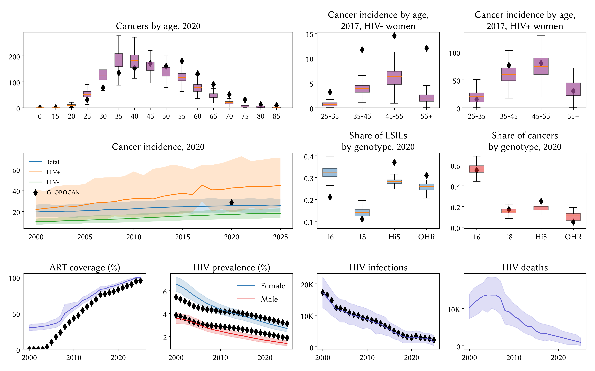
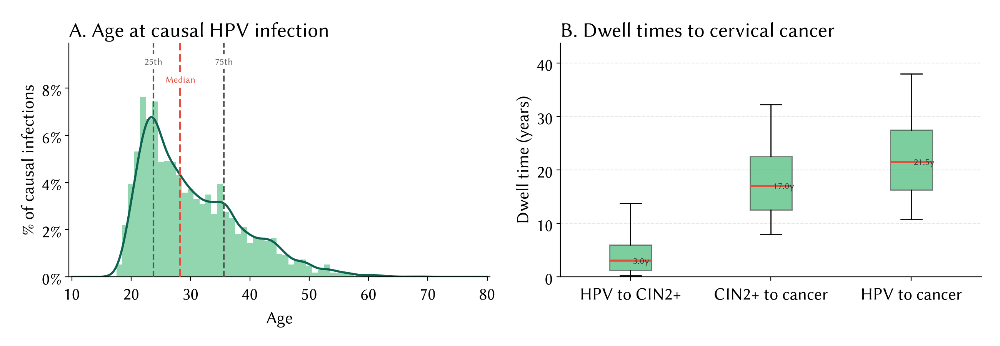
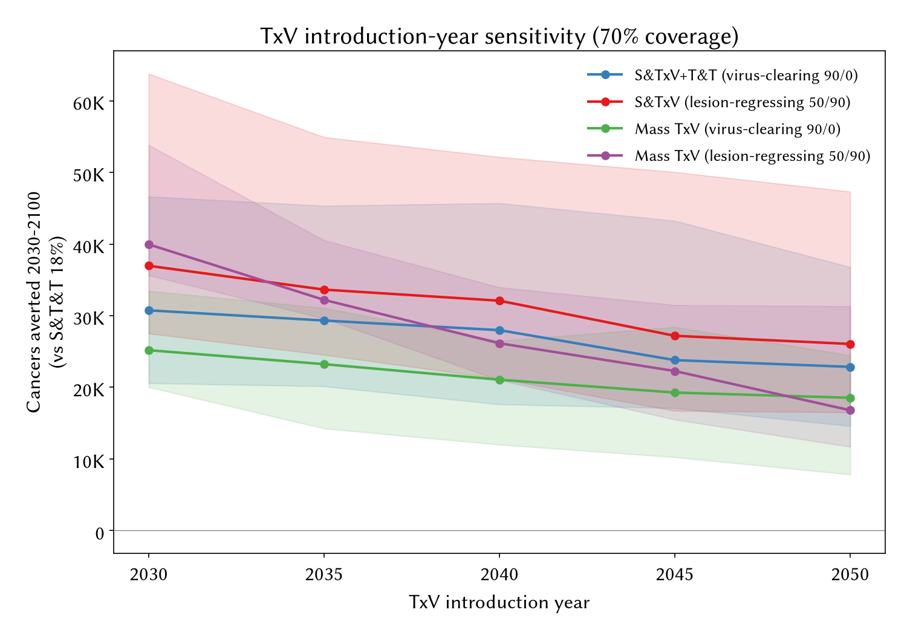
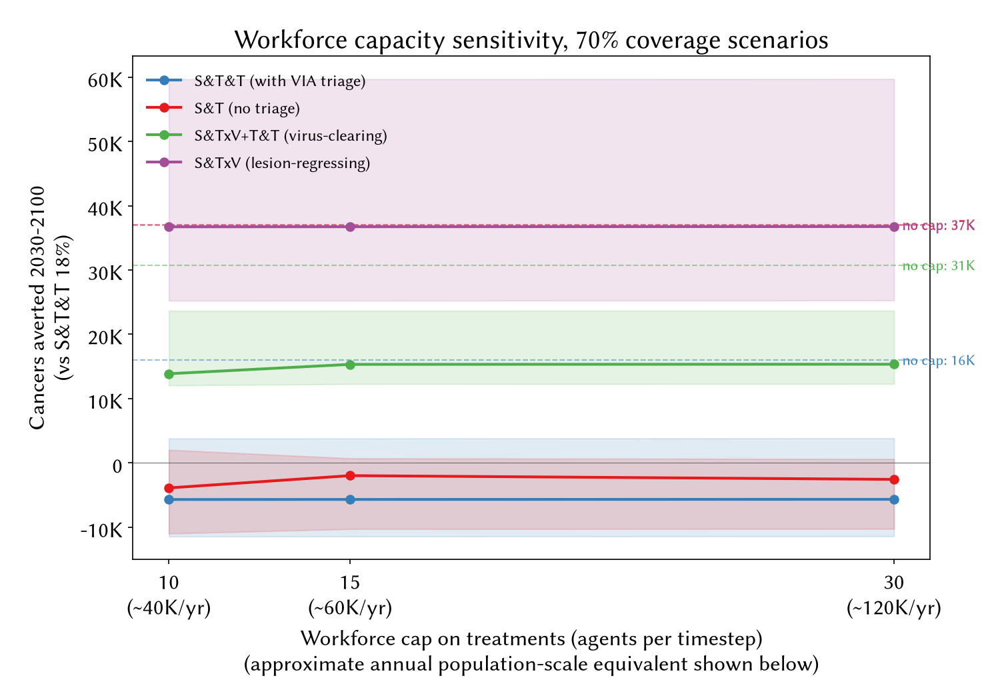

# Supplementary materials for Strategies to accelerate cervical cancer elimination: a modeling study in Rwanda

## Figure S1: Rwanda's screening and treatment algorithm

*Caption: Rwanda's screening and treatment algorithm.*

## Figure S2: model calibration

*Caption: model calibration to data. Black markers indicate data, with sources listed below. The first row shows the fit to cancer by age for the whole population (data from GLOBOCAN) and disaggregated by HIV status. The second row shows the fit to additional GLOBOCAN data, including the age-standardized rate of cancer incidence (left panel), and the distribution of LSILs and cancers by genotype. The bottom row shows the model fit to HIV data, which is sourced from UNAIDS. For each indicator, we plot the medians and 10-90% ranges of the 50 best-fitting parameter sets.*

## Figure S3: natural history under baseline programs

*Caption: natural history of HPV infection and cervical cancer in Rwandan women under the baseline scenario (routine prophylactic vaccination plus status-quo 18% screen-and-treat), across cancers occurring 2020-2050. (A) Age at causal HPV infection, showing the distribution and 25th/50th/75th percentiles. (B) Dwell times (in years) from causal infection to CIN2+, from CIN2+ to cancer, and total time from causal infection to cancer.*

## Figure S4: TxV introduction-year sensitivity

*Caption: cumulative cancers averted 2030-2100 relative to the S&T&T 18% baseline as a function of the year the therapeutic vaccine becomes available, across the four TxV-carrying strategies at 70% coverage. Shaded regions show 10-90% intervals across the 50 best-fitting parameter sets.*

## Figure S5: workforce capacity sensitivity

*Caption: cumulative cancers averted 2030-2100 relative to the S&T&T 18% baseline as a function of workforce capacity for ablation and excision procedures, expressed as a multiplier of the current (2028) national throughput at 18% coverage (~34,700 ablations per year). Lines show the four S&T-family strategies at 70% coverage; dashed lines show the no-cap value for each. Shaded regions show 10-90% intervals across the 50 best-fitting parameter sets.*

## Table S1: calibrated parameters, priors and posteriors

| parameter | description | prior_source | prior_low | prior_high | posterior_median | posterior_ci_lo | posterior_ci_hi |
|---|---|---|---|---|---|---|---|
| beta | HPV transmission probability per act | HPVsim defaults; range widened to accommodate Rwanda-specific fit | 0.020 | 0.700 | 0.460 | 0.280 | 0.680 |
| hpv16.cin_fn.k | HPV16 dose-response shape (dysplasia progression rate) | Prior from HPVsim natural-history calibration (Stuart et al. 2024) | 0.250 | 0.350 | 0.330 | 0.260 | 0.350 |
| hpv18.cin_fn.k | HPV18 dose-response shape (dysplasia progression rate) | Prior from HPVsim natural-history calibration (Stuart et al. 2024) | 0.200 | 0.300 | 0.240 | 0.220 | 0.278 |
| hi5.cin_fn.k | Pooled Hi5 (31/33/45/52/58) dose-response shape | Prior from HPVsim natural-history calibration (Stuart et al. 2024) | 0.150 | 0.250 | 0.200 | 0.150 | 0.240 |
| ohr.cin_fn.k | Pooled OHR (35/39/51/56/59) dose-response shape | Prior from HPVsim natural-history calibration (Stuart et al. 2024) | 0.150 | 0.250 | 0.170 | 0.150 | 0.250 |
| age_risk.risk | Age-dependent multiplier on HPV acquisition risk | Introduced in this study to fit the observed age distribution of causal infection | 1.500 | 3.500 | 3.000 | 1.500 | 3.500 |
| imm_init.low | Lower bound of initial humoral immunity after natural clearance | Introduced in this study; prior from HPVsim natural-history defaults | 0.300 | 0.850 | 0.600 | 0.500 | 0.850 |
| cell_imm_init.low | Lower bound of initial cell-mediated immunity after lesion regression | Introduced in this study; prior from HPVsim natural-history defaults | 0.200 | 0.700 | 0.250 | 0.200 | 0.689 |
| network.m_cross_layer | Male probability of a concurrent partnership across marital/casual layers | Prior from HPVsim network calibration (Stuart et al. 2024) | 0.350 | 0.950 | 0.850 | 0.711 | 0.900 |
| network.f_cross_layer | Female probability of a concurrent partnership across marital/casual layers | Prior from HPVsim network calibration (Stuart et al. 2024) | 0.200 | 0.950 | 0.800 | 0.750 | 0.939 |
| network.m_partners_casual | Male mean casual partners per year (Poisson rate) | Prior from HPVsim network calibration (Stuart et al. 2024) | 0.100 | 0.600 | 0.250 | 0.100 | 0.527 |
| network.f_partners_casual | Female mean casual partners per year (Poisson rate) | Prior from HPVsim network calibration (Stuart et al. 2024) | 0.100 | 0.600 | 0.350 | 0.111 | 0.550 |
| hiv.rel_sus_lo | HIV+ relative HPV susceptibility at low CD4 | Prior informed by Liu et al. 2018 meta-analysis (ref 26) | 2.000 | 5.000 | 3.000 | 2.000 | 5.000 |
| hiv.rel_sus_hi | HIV+ relative HPV susceptibility at high CD4 | Prior informed by Liu et al. 2018 meta-analysis (ref 26) | 2.000 | 4.000 | 2.250 | 2.000 | 3.500 |
| hiv.rel_sev_lo | HIV+ relative multiplier on HPV disease progression at low CD4 | Prior informed by Liu et al. 2018 meta-analysis (ref 26) | 1.500 | 5.000 | 2.500 | 1.500 | 4.694 |
| hiv.rel_sev_hi | HIV+ relative multiplier on HPV disease progression at high CD4 | Prior informed by Liu et al. 2018 meta-analysis (ref 26) | 1.500 | 5.000 | 1.750 | 1.500 | 2.194 |
| hiv.p_effective_art | Probability that ART fully suppresses HIV-driven HPV effects | Prior from UNAIDS ART effectiveness estimates | 0.700 | 0.950 | 0.840 | 0.760 | 0.950 |

*Caption: Prior distributions and posterior estimates for the 17 parameters of the model that were adjusted through calibration. The posterior summary reports the median and 95% credible interval across the 50 best-fitting parameter sets identified from 10,000 calibration trials.*

## Table S2: cumulative intervention counts by scenario, 2030-2100

| scenario | cumulative_cancers | screens | ablations | LEEP_procedures | radiation_courses | therapeutic_vaccine_doses | prophylactic_vaccine_doses |
|---|---|---|---|---|---|---|---|
| No interventions | 304,320 | 0 | 0 | 0 | 0 | 0 | 0 |
| S&T&T 18% | 100,969 | 7,833,809 | 1,102,074 | 53,465 | 119,143 | 0 | 13,539,722 |
| S&T&T 35% | 94,348 | 14,323,237 | 1,880,674 | 88,911 | 214,607 | 0 | 13,558,636 |
| S&T&T 70% | 87,241 | 27,501,360 | 3,582,931 | 173,204 | 360,557 | 0 | 13,539,422 |
| S&T 18% | 94,755 | 7,698,433 | 2,079,792 | 94,570 | 118,398 | 0 | 13,557,296 |
| S&T 35% | 85,204 | 14,054,420 | 3,558,805 | 168,141 | 195,842 | 0 | 13,554,466 |
| S&T 70% | 62,759 | 25,477,863 | 5,538,368 | 263,008 | 304,709 | 0 | 13,541,807 |
| S&T 70%, 50% LTFU | 77,729 | 26,688,208 | 4,331,448 | 130,611 | 345,664 | 0 | 13,556,547 |
| S&TxV&T&T 18% | 99,632 | 7,721,517 | 1,063,054 | 50,338 | 109,761 | 2,819,969 | 13,546,424 |
| S&TxV&T&T 35% | 86,796 | 13,791,859 | 1,703,449 | 81,464 | 198,522 | 4,546,055 | 13,543,296 |
| S&TxV&T&T 70% | 71,169 | 25,458,502 | 2,825,926 | 130,313 | 313,495 | 7,482,188 | 13,553,420 |
| S&TxV 18% | 95,904 | 7,707,964 | 33,211 | 1,191 | 4,021 | 2,787,949 | 13,561,317 |
| S&TxV 35% | 86,425 | 14,011,082 | 67,912 | 2,979 | 7,893 | 4,746,066 | 13,538,680 |
| S&TxV 70% | 64,098 | 25,755,466 | 154,439 | 6,851 | 18,169 | 7,666,413 | 13,549,702 |
| HPV-Faster 18% | 92,574 | 7,652,265 | 997,824 | 43,636 | 106,335 | 0 | 13,548,957 |
| HPV-Faster 35% | 81,466 | 7,692,624 | 976,825 | 47,062 | 103,059 | 0 | 13,549,403 |
| HPV-Faster 70% | 58,970 | 6,830,326 | 637,714 | 30,381 | 70,741 | 0 | 13,555,663 |
| Mass TxV 90/0, 18% | 95,852 | 7,507,804 | 985,463 | 46,913 | 111,995 | 1,694,215 | 13,556,551 |
| Mass TxV 90/0, 35% | 91,085 | 7,620,692 | 1,000,802 | 48,998 | 111,399 | 3,298,626 | 13,546,573 |
| Mass TxV 90/0, 70% | 79,093 | 6,967,936 | 747,474 | 34,700 | 93,825 | 6,564,786 | 13,552,232 |
| Mass TxV 50/90, 18% | 93,466 | 7,733,729 | 1,019,567 | 47,657 | 113,782 | 1,694,215 | 13,552,083 |
| Mass TxV 50/90, 35% | 81,108 | 7,543,249 | 919,934 | 42,147 | 96,655 | 3,298,626 | 13,547,466 |
| Mass TxV 50/90, 70% | 61,685 | 6,851,325 | 615,970 | 28,445 | 70,741 | 6,564,786 | 13,542,254 |

*Caption: Cumulative counts of interventions delivered under each scenario over 2030-2100. Numbers show medians across the 50 best-fitting parameter sets. Columns cover: HPV DNA screens; ablative treatments; LEEP (large loop excision of the transformation zone) procedures; radiation courses for invasive cancer; therapeutic HPV vaccine doses; and prophylactic HPV vaccine doses (routine plus any campaign-linked doses).*

## Table S3: threshold therapeutic vaccine per-dose price

| Scenario | Comparator | DALYs averted (median, 10-90% CI) | Extra TxV doses (median) | Max P* at $130/DALY | Max P* at $450/DALY | Max P* at $900/DALY |
|---|---|---|---|---|---|---|
| S&TxV 18% | S&T&T 18% | +60,689 (+34,800 to +94,881) | 1,397,149 | $88 ($36 to $166) | $102 ($50 to $180) | $122 ($69 to $200) |
| S&TxV 18% | S&T 70% | -323,062 (-387,890 to -234,048) | 1,397,149 | $305 ($108 to $584) | $231 ($34 to $510) | $127 (-$70 to $406) |
| S&TxV 35% | S&T&T 18% | +182,096 (+149,029 to +261,374) | 2,503,243 | $41 ($20 to $76) | $64 ($43 to $99) | $97 ($76 to $132) |
| S&TxV 35% | S&T 70% | -173,968 (-245,168 to -134,734) | 2,503,243 | $164 ($61 to $310) | $141 ($39 to $288) | $110 ($8 to $257) |
| S&TxV 70% | S&T&T 18% | +385,049 (+309,098 to +589,374) | 4,032,331 | $14 ($10 to $24) | $44 ($41 to $55) | $87 ($84 to $98) |
| S&TxV 70% | S&T 70% | +10,942 (-4,261 to +57,556) | 4,032,331 | $89 ($36 to $169) | $90 ($36 to $170) | $91 ($38 to $171) |
| S&TxV&T&T 18% | S&T&T 18% | +24,837 (+1,684 to +59,180) | 1,372,809 | $5 ($4 to $8) | $11 ($9 to $14) | $19 ($17 to $22) |
| S&TxV&T&T 18% | S&T 70% | -357,808 (-473,847 to -254,954) | 1,372,809 | $227 ($77 to $433) | $143 (-$6 to $350) | $26 (-$123 to $232) |
| S&TxV&T&T 35% | S&T&T 18% | +121,990 (+69,913 to +174,953) | 2,365,963 | -$44 (-$87 to -$13) | -$28 (-$70 to $3) | -$4 (-$47 to $26) |
| S&TxV&T&T 35% | S&T 70% | -255,774 (-329,417 to -207,591) | 2,365,963 | $85 ($30 to $160) | $50 (-$5 to $126) | $1 (-$54 to $77) |
| S&TxV&T&T 70% | S&T&T 18% | +273,472 (+197,111 to +379,837) | 3,932,267 | -$73 (-$140 to -$24) | -$50 (-$118 to -$1) | -$19 (-$87 to $30) |
| S&TxV&T&T 70% | S&T 70% | -107,811 (-130,794 to -80,865) | 3,932,267 | $5 ($2 to $8) | -$4 (-$7 to -$1) | -$16 (-$19 to -$13) |
| Mass TxV 90/0, 18% | S&T&T 18% | +71,395 (+37,149 to +134,732) | 1,694,215 | $11 ($8 to $15) | $24 ($21 to $28) | $43 ($40 to $47) |
| Mass TxV 90/0, 18% | S&T 70% | -294,037 (-372,730 to -242,461) | 1,694,215 | $191 ($69 to $361) | $136 ($13 to $305) | $57 (-$65 to $227) |
| Mass TxV 90/0, 35% | S&T&T 18% | +108,290 (+61,050 to +161,300) | 3,298,626 | $8 ($6 to $11) | $18 ($16 to $21) | $33 ($31 to $36) |
| Mass TxV 90/0, 35% | S&T 70% | -283,363 (-351,507 to -205,517) | 3,298,626 | $99 ($36 to $187) | $72 ($9 to $160) | $33 (-$30 to $121) |
| Mass TxV 90/0, 70% | S&T&T 18% | +217,694 (+180,002 to +279,281) | 6,564,786 | $8 ($6 to $11) | $19 ($16 to $22) | $33 ($31 to $36) |
| Mass TxV 90/0, 70% | S&T 70% | -168,596 (-203,263 to -109,145) | 6,564,786 | $54 ($21 to $100) | $46 ($13 to $91) | $34 ($1 to $80) |
| Mass TxV 50/90, 18% | S&T&T 18% | +136,469 (+99,075 to +187,427) | 1,694,215 | $19 ($14 to $26) | $44 ($39 to $52) | $81 ($76 to $88) |
| Mass TxV 50/90, 18% | S&T 70% | -239,412 (-304,177 to -169,191) | 1,694,215 | $198 ($74 to $371) | $153 ($29 to $325) | $89 (-$35 to $262) |
| Mass TxV 50/90, 35% | S&T&T 18% | +250,430 (+214,400 to +326,950) | 3,298,626 | $18 ($13 to $26) | $43 ($37 to $50) | $77 ($72 to $85) |
| Mass TxV 50/90, 35% | S&T 70% | -113,495 (-140,854 to -79,963) | 3,298,626 | $111 ($45 to $204) | $100 ($34 to $193) | $85 ($18 to $177) |
| Mass TxV 50/90, 70% | S&T&T 18% | +508,295 (+463,150 to +678,762) | 6,564,786 | $18 ($13 to $25) | $43 ($38 to $50) | $78 ($73 to $85) |
| Mass TxV 50/90, 70% | S&T 70% | +154,719 (+127,268 to +168,739) | 6,564,786 | $65 ($29 to $115) | $72 ($37 to $122) | $83 ($47 to $133) |

*Caption: Threshold therapeutic vaccine per-dose price P\* at which each TxV-carrying scenario matches a comparator on cost per DALY averted, for three willingness-to-pay tiers (opportunity-cost anchor $130/DALY; 0.5 × Rwanda GDP per capita $450/DALY; 1 × GDP per capita $900/DALY). All streams discounted at 3%/year from 2030. Base P\* uses point-estimate unit costs ($10 per HPV DNA screen, $25 per ablation, $100 per LEEP, $1,500 per radiation course, $7 per prophylactic HPV dose); the parenthetical range reflects the low-high span across published unit-cost estimates (Campos et al 2020; WHO-CHOICE East Africa service costs; GAVI HPV vaccine pricing). DALYs averted use the incidence-based analyzer with GBD 2017 disability weights and life expectancy 84. Interpretation: for scenarios with positive DALYs averted, P\* is the price at which the scenario becomes cost-effective at the given willingness-to-pay; for scenarios with negative DALYs averted (dominated on health), a positive P\* indicates the price at which the cost savings from a smaller S&T footprint compensate for the DALYs foregone at the given willingness-to-pay. Negative P\* indicates the scenario is dominated at that willingness-to-pay even with free TxV.*
