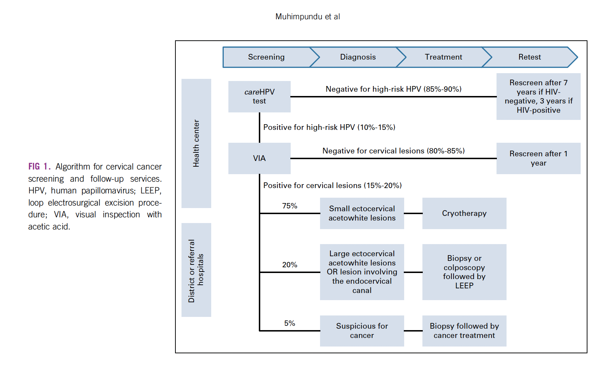

# Supplementary materials for Strategies to accelerate cervical cancer elimination: a modeling study in Rwanda

## Figure S1: Rwanda’s screening and treatment algorithm

Caption: Rwanda’s screening and treatment algorithm.

## Table S1: calibration parameters <!-- comment (Robyn Stuart): To be added once finalized -->

| Parameter | Prior distribution | Posterior estimates: mean, 95% intervals |
|---|---|---|
|  |  |  |
|  |  |  |
|  |  |  |
|  |  |  |
|  |  |  |
|  |  |  |

Caption: prior distributions and posterior estimates for the parameters of the model.

## Figure S2: model fit

Caption: model calibration to data. Black markers indicate data, with sources listed below. The first row shows the fit to cancer by age for the whole population (data from GLOBOCAN) and disaggregated by HIV status. The second row shows the fit to additional GLOBOCAN data, including the age-standardized rate of cancer incidence (left panel), and the distribution of LSILs and cancers by genotype. The bottom row shows the model fit to HIV data, which is sourced from UNAIDS. For each indicator, we plot the medians and 10-90% ranges of the 50 best-fitting parameter sets. .
